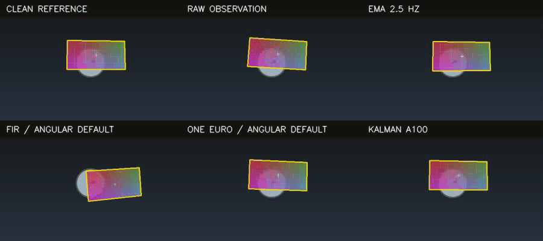
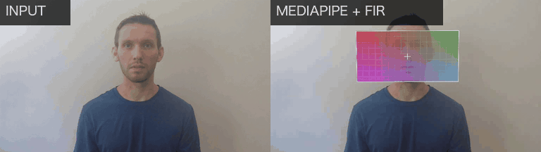
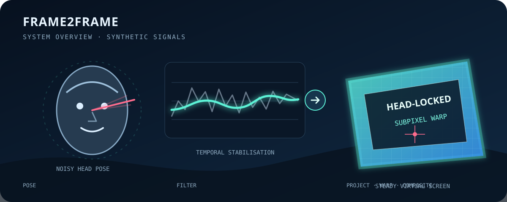

# frame2frame

**A head-orientation-driven virtual screen designed to reduce visible jitter.**

[](https://github.com/jasperzhao05/frame2frame-virtual-screen/actions/workflows/ci.yml)
[](https://www.python.org/)
[](https://github.com/jasperzhao05/frame2frame-virtual-screen/blob/main/LICENSE)

`frame2frame` estimates one person's head orientation, stabilizes the noisy
motion signal, projects a 3D plane in front of the face, and composites content
onto that plane. The rendering follows estimated head orientation while the
temporal path is designed to reduce visible detector jitter.



*Watch the yellow border: both panes use the same project-authored clip,
scripted pose stream, and seed. Only the temporal filter changes. This
comparison runs no ML model and contains no person footage.*

On a separately defined, fixed synthetic workload, `scripts.benchmark_smoothing`
measures a **71.2%** reduction in residual pose-signal jitter RMS with FIR. It
does not measure head-pose backend accuracy, real-footage performance, or
end-to-end latency.

### Real-scene stress example



*One continuous 15-second excerpt, shown at 2x playback. Source: Intel IoT
DevKit
[`driver-action-recognition.mp4`](https://github.com/intel-iot-devkit/sample-videos/raw/master/driver-action-recognition.mp4),
[CC BY 4.0](https://creativecommons.org/licenses/by/4.0/). A single fixed crop
is applied before inference; there is no per-frame reframing.*

- **Natural variation:** changing background and illumination, continuous
  yaw/pitch motion, and small body translations.
- **Graceful recovery:** one 0.83-second observation gap is left intact; stale
  geometry clears and the next fresh segment reacquires the plane.
- **Measured scope:** 422 of 450 source frames produced fresh MediaPipe
  observations (93.8%); the right pane uses the default FIR path. This is
  per-clip behavior, not backend accuracy or general robustness.

MediaPipe is the primary maintained real-video path; that designation is a
support choice, not a claim that it is the most accurate backend.

This repository is an independently rebuilt and maintained open-source edition
of a system originally developed during an internship. It does not claim
implementation equivalence to, or endorsement by, the employer. The rebuilt
edition is an installable package with interchangeable pose backends,
deterministic tests, and a reproducible model-free benchmark.

Rebuild the synthetic comparison from a source checkout with local `ffmpeg`:

```bash
python -m scripts.make_showcase --out docs/demo-comparison.gif
```

## Why it is interesting

Drawing a quadrilateral is easy. Keeping it perceptually still is not:

- a one-degree pose error can become several pixels of screen movement;
- independently smoothing yaw, pitch, roll, face center, and face size can
  misalign the rendered plane;
- a linear-phase filter attenuates jitter but introduces a known group delay;
- rounding projected corners too early reintroduces visible pixel stepping;
- phone rotation metadata, tracking dropouts, and model downloads all affect
  whether an otherwise-correct demo works end to end.

The implementation treats those as one temporal rendering problem rather than
as isolated computer-vision steps.

## Quick start from a source checkout

The commands in this section, including commands under `scripts/`, run from the
repository root:

```bash
git clone https://github.com/jasperzhao05/frame2frame-virtual-screen.git
cd frame2frame-virtual-screen
python -m venv .venv
source .venv/bin/activate              # Windows: .venv\Scripts\activate
python -m pip install -U pip
python -m pip install -e .
frame2frame --help
frame2frame --doctor
```

`--doctor` checks the supported Python range, core binary imports, the exact
MediaPipe Tasks API used by the primary backend, the plotting dependency, cache
writability, the cached model when present, and optional `ffmpeg`. It does not
download a model or open a camera. In a fresh environment, the MediaPipe import
may spend several seconds initializing Matplotlib's local font cache.

Process a video:

```bash
frame2frame --input clip.mp4 --output output/clip.mp4
```

Use a webcam with the lower-filter-lag option:

```bash
frame2frame --webcam 0 --filter oneeuro --display --output output/webcam.mp4
```

Render custom content and diagnostics:

```bash
frame2frame -i clip.mp4 --texture screen.png --axis --bbox
```

Use calibrated camera intrinsics when they are available:

```bash
frame2frame -i clip.mp4 --focal-length-px 900
```

The first MediaPipe run downloads a roughly 3.6 MB Face Landmarker asset into
`~/.cache/frame2frame`. Set `FRAME2FRAME_CACHE` to redirect the cache. Inputs are
processed locally; see the
[privacy and data-flow notes](https://github.com/jasperzhao05/frame2frame-virtual-screen/blob/main/docs/PRIVACY.md).

For configuration recipes, Python-only options, output ownership, timestamps,
and audio behavior, see the
[usage guide](https://github.com/jasperzhao05/frame2frame-virtual-screen/blob/main/docs/USAGE.md).

## Pipeline

### System overview



```text
video/webcam
    │
    ▼
rotation-aware decode ──▶ head pose ──▶ temporal filter
                                             │
                                             ▼
output ◀── composite ◀── perspective warp ◀── head-oriented 3D plane
```

1. **Decode** — OpenCV reads the source; phone rotation metadata is applied
   explicitly and the first decoded frame establishes the real output size.
2. **Estimate** — the default MediaPipe Tasks backend reads the facial
   transformation matrix and converts it to the renderer's camera coordinates.
   Hopenet and 6DRepNet are optional research adapters.
3. **Stabilize** — one temporal path advances rotation, face center, and face
   size together. The default FIR has constant group delay; One Euro is the
   lower-filter-lag live alternative.
4. **Project** — a head-oriented plane is placed along the forward ray and
   projected through a pinhole camera model.
5. **Composite** — the texture is warped with subpixel corners and alpha-blended
   without implicit mirroring. Short detection gaps hold and then fade the
   screen instead of flashing it off immediately.

The
[architecture notes](https://github.com/jasperzhao05/frame2frame-virtual-screen/blob/main/docs/ARCHITECTURE.md)
define coordinate conventions, temporal invariants, resource ownership, and
extension boundaries.

## Reliability and real-video evidence

The fast reliability check repeats the complete synthetic **file** pipeline and
gates exact frame conservation, the scripted reset-length dropout schedule with
later observations, and repeated decoded-pixel stability:

```bash
python -m scripts.benchmark_pipeline --check
```

The longer local profile processes the same 1,800-frame source five times.
Throughput is recorded but deliberately has no cross-machine pass threshold:

```bash
python -m scripts.benchmark_pipeline --extended --check
```

For the primary real-video path, a separate tool processes one attributed,
checksum-pinned Intel clip with MediaPipe + FIR and writes a JSON receipt with
the revision, full configuration, media hashes, decoded structure, frame
conservation, fresh-detection coverage, and run timings:

```bash
python -m scripts.fetch_examples --download-only --limit 1
python -m scripts.validate_real_video \
  --input examples/inputs/head-pose-face-detection-female.mp4 \
  --output output/real-video-validation.mp4 \
  --receipt output/real-video-validation.json
```

These checks are operational evidence, not pose-accuracy, perceptual-quality,
camera-latency, or production-SLO claims. See the
[reliability protocol](https://github.com/jasperzhao05/frame2frame-virtual-screen/blob/main/docs/RELIABILITY.md)
and [real-video receipt protocol](https://github.com/jasperzhao05/frame2frame-virtual-screen/blob/main/docs/VALIDATION.md).

## Deterministic filter-only reference

These reference numbers come from a seeded synthetic pose trace and cover only
temporal-filter behaviour. They do not measure pose-backend accuracy,
real-footage rendering quality, capture-to-display latency, end-to-end
throughput, or production readiness. From the repository root, run the check
without footage, a camera, network access, or model weights:

```bash
python -m scripts.benchmark_smoothing --check
```

Default quality results at 30 fps (seed `20260730`):

| Filter | Residual jitter RMS | Jitter reduction | 50% step latency | Aligned motion RMSE |
|---|---:|---:|---:|---:|
| none | 1.329° | 0.0% | 0 frames | 0.000° |
| FIR | 0.383° | 71.2% | 11 frames / 366.7 ms | 0.072° |
| One Euro | 0.867° | 34.7% | 0 frames in this test | 0.387° |

These values describe the seeded synthetic workload, not universal model
accuracy. Throughput is machine-dependent and is reported separately by the
script. Read the
[benchmark protocol](https://github.com/jasperzhao05/frame2frame-virtual-screen/blob/main/docs/BENCHMARKS.md)
before comparing changes.

## Python configuration entry point

```python
from frame2frame import PipelineConfig, run

summary = run(PipelineConfig(input="clip.mp4", output="output/clip.mp4"))
print(summary.frames, summary.mean_inference_ms)
```

This small entry point exists for configuring and testing the application; the
project does not aim to expose a broad general-purpose Python API. `run` returns
a `RunSummary`. An estimator passed directly to `run` remains
caller-owned; an estimator created from `PipelineConfig.backend` is closed by
the pipeline. The [usage guide](https://github.com/jasperzhao05/frame2frame-virtual-screen/blob/main/docs/USAGE.md)
documents the complete supported configuration reference.

## Synthetic pipeline demo

From a source checkout, run decoding, temporal processing, projection,
compositing, diagnostics, and encoding without a real face or a downloaded
model. `ScriptedEstimator` replaces pose inference, so this is a pipeline
integration demonstration rather than a pose-model accuracy or real-time
performance result:

```bash
python -m scripts.make_demo --out output/demo.mp4
```

The script generates its own input frames, pose stream, seeded detector noise,
and texture. It also writes a raw-versus-smoothed angle plot. Compare filters
without changing the input:

```bash
python -m scripts.make_demo --filter none --seed 7 --out output/raw.mp4
python -m scripts.make_demo --filter fir --seed 7 --out output/fir.mp4
python -m scripts.make_demo --filter oneeuro --seed 7 --out output/oneeuro.mp4
```

For attributed public clips:

```bash
python -m scripts.fetch_examples --download-only
python -m scripts.fetch_examples --limit 1
```

The downloaded Intel IoT DevKit samples are CC BY 4.0, checksum-verified, and
never committed. Attribution and optional model sources are recorded in
[third-party notices](https://github.com/jasperzhao05/frame2frame-virtual-screen/blob/main/THIRD_PARTY_NOTICES.md).

## Pose backends and filters

| Backend | Install | Pose source | Intended use |
|---|---|---|---|
| `mediapipe` | included by default | Face Landmarker transformation matrix | Primary maintained/default adapter; validate on target footage and hardware |
| `hopenet` | from a source checkout: `pip install -e ".[hopenet]"` | ResNet-50 binned Euler regression | Research checkpoint-compatibility adapter; paper metrics are not reproduced here |
| `6drepnet` | manual, isolated setup only | Continuous 6D rotation representation | Experimental third-party compatibility adapter; isolated setup required |

6DRepNet's published package conflicts with MediaPipe's OpenCV provider, so the
project deliberately does not advertise a one-command extra for it. Hopenet's
first run downloads a pinned 95,924,799-byte checkpoint.

`mediapipe` is the default because it is the primary dependency-complete and
maintained path, not because this repository establishes superior accuracy.
Deterministic CI does not run real pose-model inference; every backend requires
validation on the intended footage and hardware.

- **`fir`** — default fixed-delay filter for offline processing; file rendering
  can compensate its known group delay.
- **`oneeuro`** — lower filter-lag option for live preview; no end-to-end webcam
  latency claim is made.
- **`none`** — diagnostic baseline for observing detector noise.

## Known limits

Validation scope: automated tests cover software contracts and packaging; the
reliability benchmark covers a declared synthetic file workload; real-video
receipts cover operational checks on exact attributed clips. None establishes
pose-estimation accuracy, perceptual stability across users, end-to-end
real-time performance, or production readiness. The downloadable public clips
are usage examples, not a curated evaluation dataset. This is a local
research-oriented renderer, not a hardened desktop application, hosted
service, biometric system, or safety system.

- One face is tracked; identity association and multi-face rendering are not
  implemented.
- Camera intrinsics default to `focal = max(width, height)` unless supplied with
  `--focal-length-px` or `ScreenConfig`. Face-size depth remains an approximation.
- Rotation is filtered as Euler-angle streams; extreme poses near gimbal lock
  remain a limitation.
- OpenCV writes constant-frame-rate video with a portability-oriented `mp4v`
  codec. Audio is omitted unless `--preserve-audio` is used; that mode requires
  local `ffmpeg`, preserves an existing output on failure, and assumes CFR input
  when exact synchronization matters.
- The system estimates head orientation, not eye gaze, identity, attention,
  intent, or medical state.
- Optional deep backends need more cross-device and real-footage validation than
  the default MediaPipe path.

## Project map

```text
frame2frame/
  pose/             backend interface and MediaPipe/Hopenet/6DRepNet adapters
  filters.py        FIR and One Euro temporal filters
  _tracking.py      internal dropout segments, filter progression, alignment
  geometry.py       camera math and gaze-plane projection
  _textures.py      internal texture loading and color/alpha normalization
  render.py         perspective projection, alpha compositing, debug overlays
  video.py          rotation-aware video/webcam decode and encoding
  _media.py         internal atomic publication and optional audio remuxing
  _diagnostics.py   internal bounded, delay-aligned angle plots
  _doctor.py        internal no-download, no-device runtime readiness checks
  pipeline.py       resource wiring and end-to-end stage orchestration
  cli.py            command-line interface
scripts/
  make_demo.py              owned, synthetic pipeline demonstration
  benchmark_smoothing.py    deterministic model-free quality benchmark
  benchmark_pipeline.py     repeated model-free file-pipeline reliability check
  fetch_examples.py         attributed, checksum-verified public examples
  validate_real_video.py    evidence-bounded operational receipt for one clip
tests/              unit, invariant, integration, packaging, and CLI tests
```

New contributors should start with the
[architecture reading order](https://github.com/jasperzhao05/frame2frame-virtual-screen/blob/main/docs/ARCHITECTURE.md#reading-order),
then use the change-to-test map in
[CONTRIBUTING.md](https://github.com/jasperzhao05/frame2frame-virtual-screen/blob/main/CONTRIBUTING.md).

## Contributing, citation, and license

Please use [GitHub issues](https://github.com/jasperzhao05/frame2frame-virtual-screen/issues)
for bugs and [GitHub Security Advisories](https://github.com/jasperzhao05/frame2frame-virtual-screen/security/advisories/new)
for vulnerabilities. Do not attach private face footage to a public report.

If this project supports published work, cite
[`CITATION.cff`](https://github.com/jasperzhao05/frame2frame-virtual-screen/blob/main/CITATION.cff)
and the underlying pose/filter papers listed in the
[third-party notices](https://github.com/jasperzhao05/frame2frame-virtual-screen/blob/main/THIRD_PARTY_NOTICES.md).

Project code and owned documentation are released under the
[MIT License](https://github.com/jasperzhao05/frame2frame-virtual-screen/blob/main/LICENSE).
Downloaded models and example footage retain their upstream terms.
